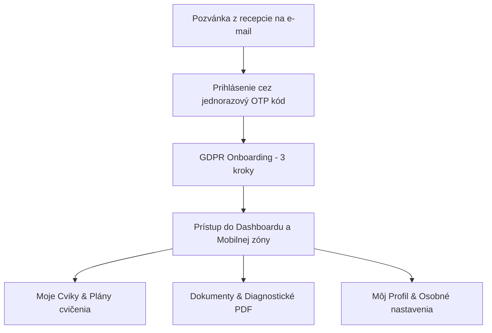

# Používateľská príručka pre klienta & Predajná prezentácia systému (SportWell v3.0)

Tento dokument slúži ako **klientsky manuál** a zároveň ako **kľúčový predajný argument (Sales Pitch)** pre kliniky, fitness centrá a rehabilitačné strediská. Ukazuje, ako systém SportWell posúva klientsky zážitok (Customer Experience) na prémiovú úroveň, zjednodušuje komunikáciu so špecialistami a kompletne odbúrava papierovú byrokraciu.

---

## 🌟 PREČO JE SPORTWELL KĽÚČOVÝM PREDAJNÝM ARGUMENTOM PRE VAŠU KLINIKU?

V dnešnej dobe klienti očakávajú viac než len cvičenie – očakávajú **profesionálny prístup, digitálne pohodlie a absolútnu kontrolu nad svojím zdravím**. SportWell spája medicínsku precíznosť s modernými technológiami.

### 🚀 Hlavné predajné piliere (Prečo si klienti vyberú práve vás):

1. **Moderný a prémiový dizajn (Glassmorphism PWA):**
   Aplikácia vyzerá a funguje ako natívna mobilná aplikácia. Žiadne zložité inštalácie z App Store/Google Play – klient si ju jednoducho pridá na plochu jedným kliknutím a má okamžitý prístup k svojim plánom aj offline.
2. **Bezpečnosť a dôvera (Passwordless OTP & GDPR):**
   Žiadne zraniteľné heslá. Klient sa prihlasuje bezpečne pomocou jednorazového kódu zaslaného na jeho e-mail. Všetky osobné a diagnostické údaje sú pod prísnym zámkom databázového šifrovania.
3. **Transparentnosť dokumentov (Zmluvy a diagnostika v mobile):**
   Klient má všetky podpísané GDPR zmluvy, zmluvy o nájme prístrojov a hlavne lekárske/tréningové diagnostiky okamžite dostupné v PDF formáte priamo vo svojom profile.
4. **Individuálny a presný tréning:**
   Žiadne papieriky s načarbanými cvikmi. Interaktívne tréningové plány s inštruktážnymi videami/obrázkami, presným popisom tempa, sérií, opakovaní a relatívneho úsilia (RPE).
5. **Okamžitá odozva (Feedback Loop):**
   Zapisovanie reálnych výkonov z tréningu priamo v aplikácii umožňuje špecialistovi sledovať progres klienta v reálnom čase a flexibilne upravovať plány.

---

## 📱 SPRIEVODCA PRE KLIENTA: AKO TO FUNGUJE V PRAXI

### 1. Prvé prihlásenie a Onboarding
Keď klient prvýkrát navštívi vašu kliniku, recepcia ho zaeviduje do systému a odošle mu pozvánku.
* **Prihlásenie:** Klient zadá svoj e-mail a obratom dostane jednorazový 6-miestny kód, ktorý zadá do aplikácie. Nemusí si pamätať žiadne heslá.
* **GDPR Onboarding (Digitálny podpis):** 
  Pri prvom vstupe systém klienta bezpečne navedie na 3-krokového sprievodcu:
  1. *Osobné údaje:* Klient doplní telefónne číslo a adresu.
  2. *Služby:* Zvolí si zameranie (napr. Fyzioterapia, Silový tréning).
  3. *Právne súhlasy:* Odsúhlasí GDPR podmienky a voliteľne marketingové/diagnostické súhlasy.
  Aplikácia na pozadí automaticky vygeneruje profesionálnu GDPR dohodu v PDF, digitálne ju podpíše a uloží do zložky dokumentov klienta.

---

### 2. Mobilná zóna a jednoduchá navigácia
Pre maximálne pohodlie pri cvičení priamo na tréningu majú klienti na smartfónoch k dispozícii **spodnú fixnú lištu** s rýchlymi odkazmi:

* 🏠 **Home (Nástenka):** Rýchly prehľad priradených tréningov, najbližších diagnostík a dôležitých oznamov kliniky.
* 🏋️ **Moje Cviky:** Všetky predpísané tréningové plány na jednom mieste.
* 📄 **Dokumenty:** Miesto, kde nájdu svoje zmluvy a kompletné diagnostické PDF správy.
* 👤 **Profil:** Správa osobných údajov, prehľad o priradených špecialistoch (fyzioterapeuti, lekári, tréneri).

---

### 3. Interaktívny tréningový plán (Moje Cviky)
Klient už nemusí tápať, či cvičí správne. V detaile plánu vidí:
* **Inštruktážne médiá:** Každý cvik obsahuje video alebo názornú animáciu (GIF) zobrazenú priamo v telefóne.
* **Dôkladné parametre:**
  * **Série a Opakovania:** Presný rozsah (napr. 4 série po 10 opakovaní).
  * **Tempo (napr. `3-0-1-0`):** Návod, ako dlho má trvať spúšťanie váhy, pauza a samotný pohyb.
  * **RPE (Stupeň úsilia):** Odporúčaná intenzita a rezerva v sile na stupnici od 1 do 10 (chráni pred zranením).
  * **Rozcvička:** Poznámky trénera k zahriatiu kĺbov a svalov pred výkonom.
* **Vlastné cviky od trénera:** Ak tréner vytvorí špecifický cvik priamo pre klienta (napr. špeciálna mobilizačná technika), klient ho uvidí vo svojom pláne aj s nahranou fotografiou.

---

### 4. Záznam tréningu a sledovanie progresu
Cvičenie je obojstranný proces. Klient môže priamo počas tréningu zaznamenať reálne odvedenú prácu:
1. Otvorí si tréning a klikne na **"Zaznamenať tréning"**.
2. Pre každú sériu zapíše **skutočný počet opakovaní a použitú váhu (kg)**.
3. Ak počas tréningu pridal iný cvik, jednoducho ho vyhľadá v databáze a pripojí k logu.
4. Na záver zadá dĺžku cvičenia v minútach, subjektívnu náročnosť (1 - 5 hviezdičiek) a krátku slovnú odozvu pre svojho trénera.
5. Údaje sa okamžite synchronizujú do profilu, kde ich tréner vyhodnotí pre ďalší rozvoj.

---

### 5. Moje Dokumenty (Archív a preberanie správ)
Všetka medicínska a právna administratíva je plne transparentná a digitálna:
* **Diagnostické reporty:** Výsledky vyšetrení od lekára alebo fyzioterapeuta (držanie tela, sken InBody, funkčné testy) sú automaticky pretransformované do profesionálnych PDF dokumentov s hlavičkou kliniky. Klient ich nemusí nikde žiadať, má ich ihneď v mobile na stiahnutie.
* **Nájomné zmluvy (Rentals):** Pri zapožičaní rehabilitačného prístroja na domáce liečenie (napr. PowerDot, elektrostimulátor) prebehne podpis zmluvy digitálne cez 5-krokového sprievodcu priamo v rozhraní. Dokument je archivovaný v sekcii *Dokumenty*.
* **Uzamknutie GDPR súhlasov:** Pre bezpečnosť klienta a súlad s legislatívou sú GDPR súhlasy v profile klienta zobrazené ako uzamknuté (read-only). Akákoľvek zmena sa robí opätovným fyzickým/digitálnym vygenerovaním novej zmluvy na recepcii, čo garantuje, že databáza vždy 100% korešponduje so zmluvným PDF.

---

## 🧪 AKO TESTOVAŤ SYSTÉM PODĽA ROLÍ (UAT TESTOVACIE SCENÁRE)

Na overenie správania a overenie správneho nastavenia oprávnení v databáze (RLS a RBAC) použite nasledujúce testovacie prípady rozdelené podľa rolí:

### 👑 1. TESTOVACIE SCENÁRE PRE ROLU: Majiteľ / Administrátor
**Úroveň prístupu:** Plné práva na správu celej kliniky (Super User).

* **Čo môže robiť (Pravomoci):**
  * Spravovať všetkých zamestnancov (vytvárať pozvánky, mazať ich, meniť roly, blokovať účty cez prepínač `is_active`).
  * Upravovať **Maticu oprávnení (RBAC)** pre všetky ostatné roly v `/nastavenia`.
  * Vidieť a upravovať všetkých klientov a ich priradenia k jednotlivým špecialistom.
  * Zobrazovať kompletné systémové audit logy zmien v reálnom čase.
  * Vytvárať a mazať globálne diagnostické šablóny.
* **Ako otestovať:**
  1. Prihláste sa pod administrátorským účtom a prejdite do `/nastavenia`. Zmeňte oprávnenie pre rolu `trener` (napr. vypnite povolenie čítania modulu *Diagnostika*) a uložte.
  2. Prejdite na `/zamestnanci` a overte, že môžete odoslať novú zamestnaneckú pozvánku a že môžete deaktivovať existujúceho trénera.
  3. Prejdite do sekcie `/klienti` a v detaile akéhokoľvek klienta zmeňte priradených trénerov cez modálne okno. Overte, že zmena sa ihneď prejavila.

---

### 🩺 2. TESTOVACIE SCENÁRE PRE ROLU: Špecialista (Tréner / Fyzioterapeut / Lekár)
**Úroveň prístupu:** Izolovaný prístup na základe priradenia (Multi-Tenancy) a priradených práv v matici.

* **Čo môže robiť (Pravomoci):**
  * Vidieť a spravovať **iba tých klientov**, ktorí mu boli priradení administrátorom/recepciou.
  * Vytvárať, editovať a priraďovať tréningové plány pre priradených klientov.
  * Vytvárať vlastné cviky (súkromné), ktoré nevidia iní tréneri, pokiaľ ich nepriradia do plánu.
  * Vypĺňať diagnostické formuláre pre priradených klientov.
  * *GDPR Bypass:* Udeliť zástupný súhlas (papierová verzia podpísaná na klinike), ak klient ešte neprešiel online onboardingom.
* **Ako otestovať:**
  1. Vytvorte dvoch špecialistov (Tréner A, Tréner B). Priraďte Klienta X trénerovi A.
  2. Prihláste sa ako Tréner B a uistite sa, že v zozname klientov `/klienti` **nevidíte** Klienta X a nemáte prístup k jeho údajom ani plánom.
  3. Prihláste sa ako Tréner A. Prejdite na `/klienti` $\rightarrow$ Klient X. Uistite sa, že ho vidíte a môžete mu spravovať plány.
  4. Vytvorte nový vlastný cvik (`is_custom = true`). Overte, že ho môžete pridať do plánu klienta X. Prihláste sa opäť ako Tréner B a uistite sa, že tento cvik v databáze nevidíte.
  5. Otvorte `/diagnostika` a vyberte klienta, ktorý nemá podpísané GDPR (svieti červená ikona). Overte, že bez zástupného súhlasu nemôžete spustiť diagnostiku. Následne kliknite na *"Udeliť zástupný súhlas"*, čím sa formulár sprístupní a po vyplnení sa vygeneruje správne PDF.

---

### 👤 3. TESTOVACIE SCENÁRE PRE ROLU: Klient
**Úroveň prístupu:** Striktne chránená zóna vlastných údajov na mobilnom rozhraní.

* **Čo môže robiť (Pravomoci):**
  * Zobrazovať svoje vlastné tréningové plány.
  * Zaznamenávať svoje tréningy (opakovania, váhy, RPE, spätnú väzbu).
  * Stiahnuť si svoje diagnostické správy a podpísané zmluvy v PDF zložke `/dokumenty`.
  * Spravovať údaje v profile (telefón, adresa). **Nemá** možnosť zmeniť svoje GDPR súhlasy v profile (marketing, meta, diagnostika) – tie sú len na čítanie.
* **Ako otestovať:**
  1. Pozvite nového klienta cez recepciu. Prihláste sa pod jeho e-mailom pomocou OTP kódu.
  2. Uistite sa, že pri prvom prihlásení vás systém **nepustí do aplikácie** a zobrazí sa iba `/gdpr` sprievodca bez navigačného menu.
  3. Dokončite onboarding. Uistite sa, že po dokončení ste presmerovaní na dashboard, v `/dokumenty` nájdete vygenerovanú GDPR dohodu a už sa na stránku `/gdpr` neviete dostať.
  4. Prejdite na `/profil` a skúste zmeniť prepínače GDPR súhlasov – uistite sa, že sú sivé a hodnota sa nedá prepísať. Upravte iba telefónne číslo a overte uloženie.
  5. Otvorte `/plan` (Moje Cviky) a spustite záznam tréningu. Vyplňte jednotlivé série, uložte tréning a overte, že sa uložil do histórie cvičení.

---

## 📈 PREDAJNÝ ARGUMENT PRE PREVÁDZKOVATEĽOV (B2B BENEFITY)

| Vlastnosť | Tradičná klinika (Papier / Staré systémy) | SportWell Klinika (Moderný digitálny štandard) |
| :--- | :--- | :--- |
| **Registrácia a GDPR** | Papierové formuláre, prepisovanie do PC, riziko straty papiera. | Digitálny 3-krokový sprievodca na mobile klienta, automatické generovanie a nahrávanie PDF. |
| **Prístup k údajom** | Klient musí o správy z diagnostiky žiadať recepciu, posielanie e-mailom (nebezpečné). | Okamžitý zabezpečený prístup k PDF správam a nájomným zmluvám v klientskej zóne. |
| **Tréningové plány** | Papieriky, tabuľky v Exceli, ústne vysvetľovanie bez videa. | Interaktívna mobilná PWA aplikácia s videami cvikov, tempom, RPE a zápisom tréningu. |
| **Bezpečnosť údajov** | Zdieľané excelovské súbory, tréneri vidia všetkých pacientov. | **Multi-Tenancy RLS**. Tréner vidí iba svojich priradených klientov. Citlivé medicínske dáta sú chránené. |
| **Flexibilita a úpravy** | Fixné šablóny a dotazníky, ktoré si vyžadujú platený zásah programátora. | **Dynamic Form Builder**. Tvorba akýchkoľvek diagnostík a dotazníkov priamo administrátorom bez kódovania. |

**SportWell robí z vašej kliniky moderné pracovisko 21. storočia, ktoré si klienti zamilujú pre jeho prehľadnosť, bezpečnosť a moderný komfort.**
